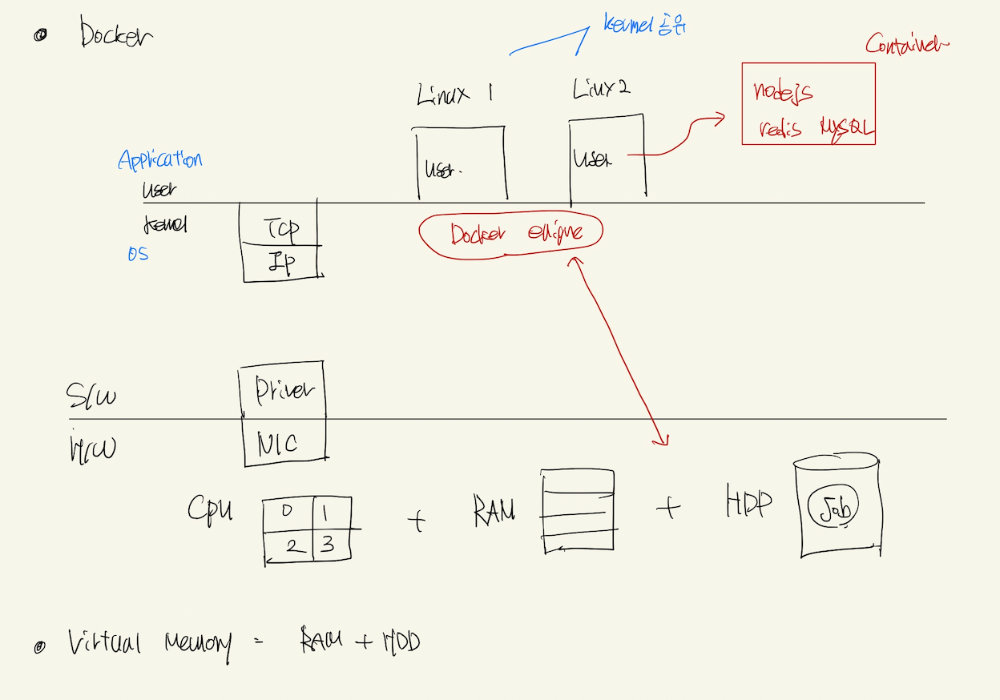

# Docker 이론

## Process And Thread

- Process 라는 것은 관리의 단위
- 한개의 Process는 최소 1개의 Thread (Single Thread) 를 갖는다 (n 개까지) (Multi Thread)

</img>

- 하나의 Process는 연산과 Ram 작업이 발생한다.
- 연산은 CPU 작업 이기 때문에 CPU 할당이 이뤄진다.
- RAM은 Virtula Memory이 미리 할당된 후에 해당 메모리 주소값이 실제 RAM (Physical Memory) 또는 하드디스크 (HDD)로 바인딩 된다

</img>

- 프로세스의 작업은 최소 1개의 Thread를 가진다. (연산)
- OS는 Virtual Memory를 Process에게 할당한다 (제한된 공간)
- 따라서 Process에 속한 모든 Thread는 Process의 가상 메모리 Virtual Memory로 공간이 제약된다.

## Docker vs VM

</img>

- 여러 Process가 돌아가는 환경을 Multi Tasking

## VM

</img>

- NIC 컴퓨터 마다 한대씩 존재
- VM 환경에서는 소프트웨어 NIC이 존재한다
- Virtual NIC Dirver를 통하여서 인터넷에 접속한다
- Guest OS 안에 모든것들은 SoftWare로 구현하였다
- Guest OS SoftWare NIC은 Host OS의 Virtual NIC을 L2 Switch로 사용한다

### VM에서의 인터넷 브라우저 원리

- SoftWare NIC -> Host OS Virtual NIC Dirver -> VM NAT(공유기) -> Host OS NIC -> Internet

### VM의 한계점

- 각각의 VM 환경을 띄워놓았지만, 필요한 부분만 사용하고 싶을 때,
- 즉, 간단한 이유로 VM 띄워놓아도 모든것들을 구현하다 보니 Resource 낭비가 심하다

## Docker

</img>

- Docker Engine이 알아서 메모리 할당과 Response를 담당한다
- Container만 구성해주면 되니까 배포가 용이하다

## 근데, Docker내에서 Container가 죽고 에러가 난다면 ? => 쿠버네티스

- 사이트 참조
- 결론은 해당 Docker의 Container를 관리해주겠다.
