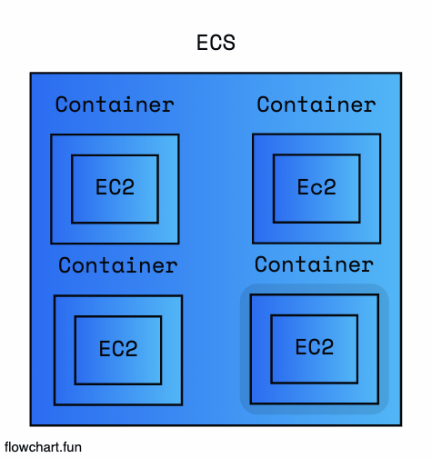
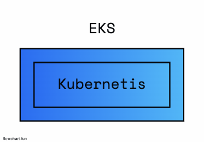
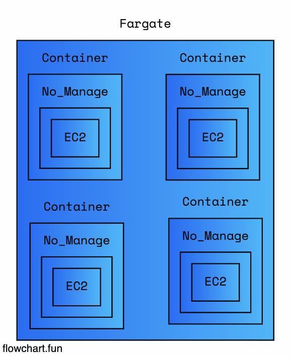

## ECS, EKS, Fargate

### Desc

- 요즘은 서버들이 다 Container구나...
- 근데 뭐가 이리 많을까?
- 각각의 차이점 공통점이 뭘까?

### ECS

- Docker Container 환경
- EC2 내부에 특정 부분을 세팅할 수 있다.

### EKS

- Kubernetis 환경
- ECS의 업그레이드 버전

### Fargate

- Container 환경
- Serverless 환경이기때문에 EC2를 관리 하지 않는다.

