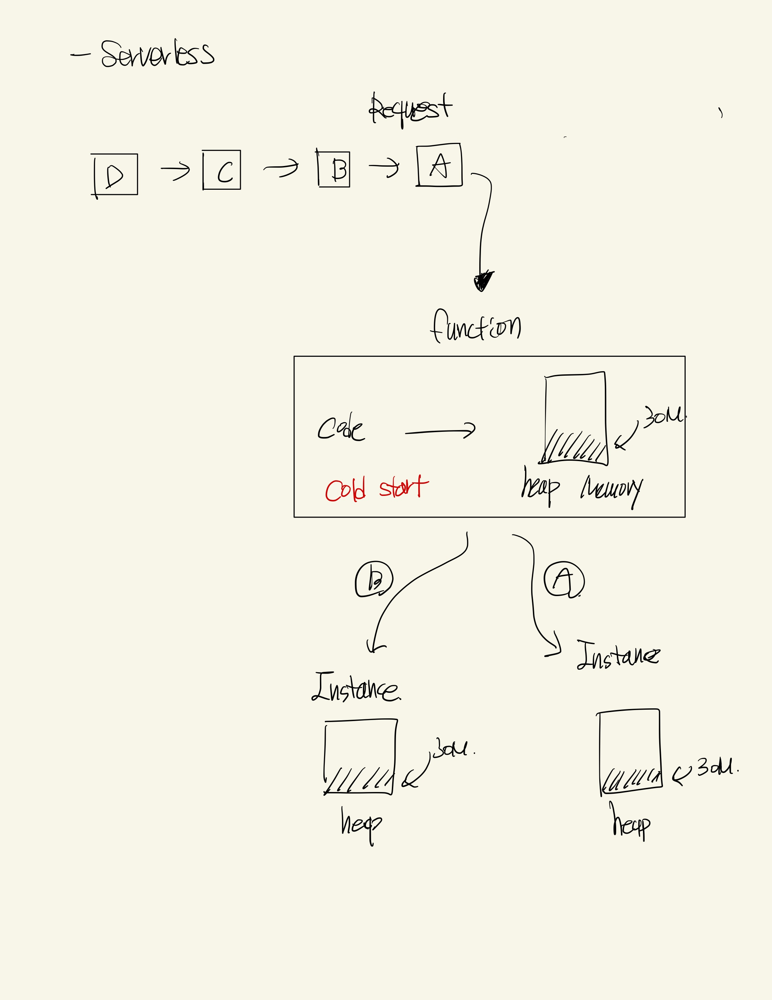
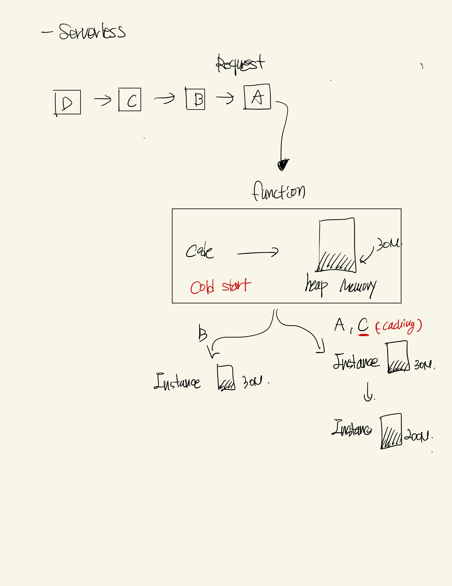
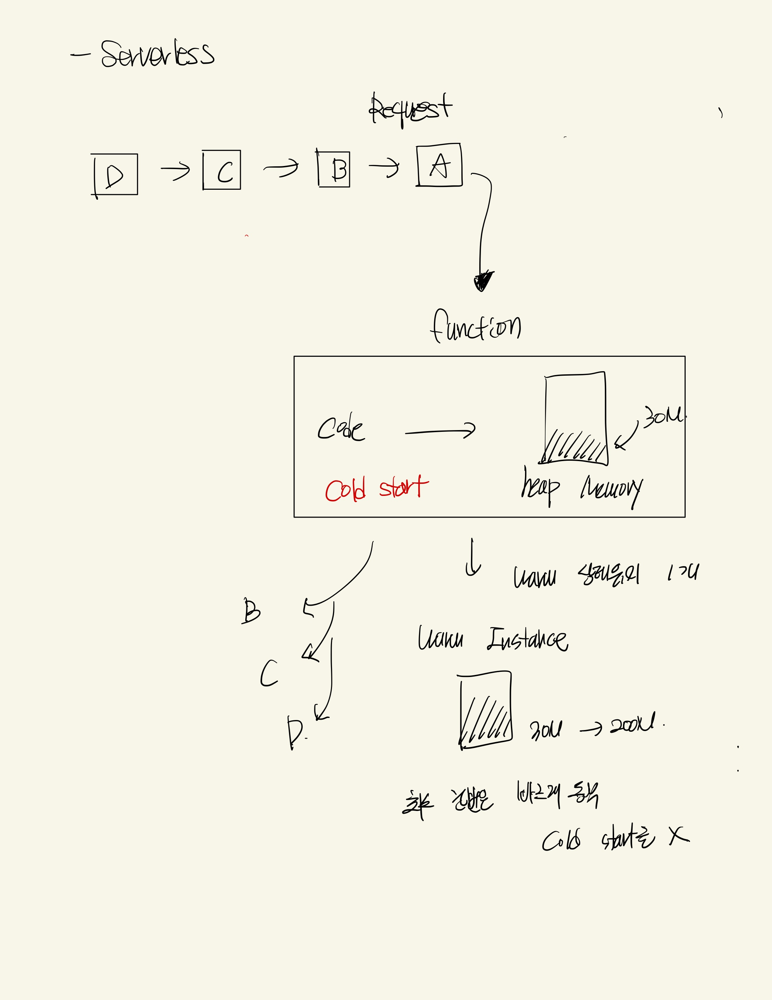

# Serverless

## Serverless

- 사진없음 그냥 글임

## Index

- Serverless
- Serverless 원리
- Serverless 최적화 기법

## ServerLess

```
    - 장점
    서버의 Scale-out 이나 Scale-up을 직접 핸들링 하지 않아도 되기 때문에,
    개발자는 Code output에만 집중할 수 있다. 그로인해 개발에만 집중할 수 있으며
    또한 비용또한 저렴하다
```

```
    - 단점
    Cold Start : 처음에 이벤트가 호출할때 실행되어 있지 않다면 해당 인스턴스를 실행하여 heap memory에 적재후
    인스턴스로 만들어서 제공한다 -> 이때 걸리는 시간을 Cold Start라 한다
    - 해결법
    -> 최소 인스턴스 : 최소 인스턴스 수를 지정하여 최소 n개만큼은 warm 상태로 유지시킨다. (현재 사용 중)
    -> 최소 n분 간격으로 호출 : 최소 n개를 warm상태로 유지시키는것이 아닌, 10~15분에 한번씩 해당 함수를 호출한다.
```

## Serverless가 동작하는 원리

- Serverless 기본적인 동작원리
  

```
    요청이 들어오면
    콜드스타트가 발생하고
    각 요청에 해당하는 인스턴스를 만들어준다.
    이때 인스턴스는 function에 기본 code의 memory를 heap에 올려둔 상태에서 시작한다
```

- Serverless Caching\*\*\*
  

```
    기본적인 동작원리 처럼 각 요청에 대한 인스턴스를 만들어주는데,
    이때 한 인스턴스에서 요청의 대한 응답 즉 끝이 났으면 해당 인스턴스는 1~3분간 warm 상태를 유지한다.
    그리고 C 요청이 들어오는 순간 warm 상태의 인스턴스를 그대로 사용하게 되는데 이때,
    기존에 사용했던 메모리들을 캐싱형태로 사용하게 된다.
```

- Serverless min Instance (최소 인스턴스)
  

  ```
    이렇듯 최소 인스턴스를 유지한다면,
    그 개수 즉 요청만큼은 cold start를 줄일 수 있다.
    좀더 빠르게 서비스를 제공할 수 있다. -> 하지만 비용적인 문제가 발생하긴 함
  ```

  ## Serverless 최적화 기법

  - 최근에 회사에서 작업을 하다가 -> Memory Leak 이슈가 발생하였다.
  - 그로인해서 서버 비용이 좀 많이 나오게 되었다. 물론 해당 이슈는 index를 하지 않아서 난거였지만,
  - 그걸 기반으로 Serverless 형태에서 Code, Logic을 어떻게 짜야하는지 조금 공부하게 되었다.

  ### 첫번째 방법 (해당 인스턴스의 메모리를 늘린다)

  - 기존 메모리를 늘리는 방법이 있다 -> 근데 항상 느끼는 건데 Scale-up은 완벽한 해결법은 아니다 -> 더 좋은 방법이 있을것이다.

  ### 두번째 방법 (code 상에서 줄이는 방법)

  - 전역변수 사용하지 않기 (안씀)
  - 사용하지 않는 변수는 null을 대입하기 -> Heap에서 메모리 없어짐
  - Stack 메모리를 잘 사용하기 \*\*\*
  - Heap 메모리를 효율적으로 사용하자
    - 참조를 넘기지 말고 객체를 복사해서 넘기자
    - Object.assign으로 객체를 복사해서 사용하자
    - 수명이 짧은 변수를 사용하자
  - 서버리스 특성 상 -> 한번에 끝내려 하지말고 함수형태로 코드로직을 구성하자

    ```ts
    // bad code
    function main() {
      // 1.
      // 2.
      // 3,
    }

    // best code
    function main() {
      first()
      second()
      thrid()
    }

    function fisrt() {}

    function second() {}

    function third() {}
    ```
